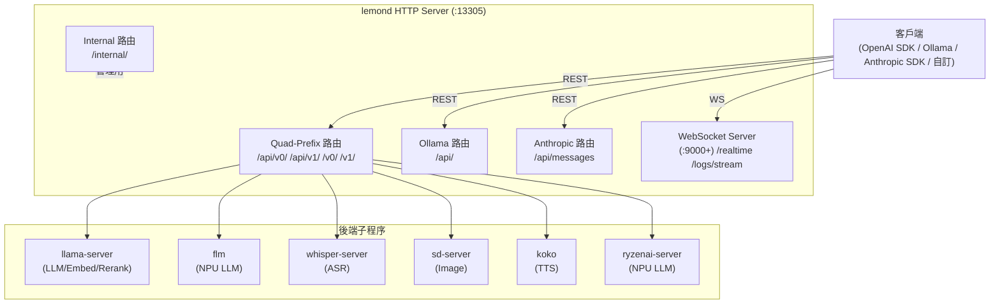

# Lemonade API 完整參考（Part 1）

> **版本**: 10.2.0 | **預設 Port**: 13305 | **基礎 URL**: `http://localhost:13305`
>
> 本文件涵蓋 Lemonade 所有 HTTP/WebSocket endpoint。續頁見 [API_SURFACE_part2.md](./API_SURFACE_part2.md)。

---

## API 分類概覽



---

## 1. Quad-Prefix 設計

Lemonade 的**所有** OpenAI 相容 endpoint 均在以下四個 prefix 下各自獨立註冊：

| Prefix | 用途 |
|--------|------|
| `/api/v0/` | 舊版（向下相容） |
| `/api/v1/` | 現行版本 |
| `/v0/` | 短版舊版（OpenAI SDK 相容） |
| `/v1/` | 短版現行版（OpenAI SDK 標準） |

**慣例**：本文件以 `/v1/` 為範例路徑，其餘三個 prefix 行為完全相同。

---

## 2. 認證（Authentication）

| 環境變數 | 適用範圍 | 說明 |
|---------|---------|------|
| `LEMONADE_API_KEY` | 所有 API 路由 | 未設定時無需認證 |
| `LEMONADE_ADMIN_API_KEY` | 所有路由（含 `/internal/`） | 若未設定，以 `LEMONADE_API_KEY` 替代 |

認證方式：HTTP `Authorization: Bearer <token>` 標頭。

| 情境 | 行為 |
|------|------|
| 未設定任何 key | 所有端點不需驗證 |
| 僅設定 `LEMONADE_API_KEY` | API 路由需驗證；`/internal/` 亦需相同 key |
| 設定 `LEMONADE_ADMIN_API_KEY` | `/internal/` 需 admin key；API 路由若未另設 key 則不驗證 |
| 驗證失敗 | HTTP 401 `{"error": "Invalid or missing API key"}` |
| 從非 localhost 呼叫 `/internal/` | HTTP 403（限本機存取） |

---

## 3. 錯誤處理格式

所有 endpoint 在發生錯誤時統一回傳 JSON：

```json
{
  "error": {
    "message": "Model Qwen3-0.6B-GGUF has not been found",
    "type": "not_found"
  }
}
```

常見 HTTP 狀態碼：

| 狀態碼 | 語義 |
|--------|------|
| 400 | 請求參數錯誤 |
| 401 | 缺少或無效的 API Key |
| 403 | 禁止存取（非 localhost 呼叫 internal） |
| 404 | 模型或資源未找到 |
| 405 | 方法不允許（對 POST 端點發 GET） |
| 500 | 伺服器內部或後端推論錯誤 |

---

## 4. OpenAI 相容 Endpoints

### `GET /v1/health`

檢查伺服器狀態與已載入模型清單。

```bash
curl http://localhost:13305/v1/health
```

**Response**：
```json
{
  "status": "ok",
  "version": "10.2.0",
  "websocket_port": 9000,
  "model_loaded": "Qwen3-0.6B-GGUF",
  "all_models_loaded": [
    {
      "model_name": "Qwen3-0.6B-GGUF",
      "checkpoint": "unsloth/Qwen3-0.6B-GGUF:Q4_0",
      "last_use": 1732123456.789,
      "type": "llm",
      "device": "gpu",
      "recipe": "llamacpp",
      "recipe_options": {"ctx_size": 4096},
      "backend_url": "http://127.0.0.1:8001/v1"
    }
  ],
  "max_models": {"llm": 1, "embedding": 1, "reranking": 1, "audio": 1, "image": 1, "tts": 1}
}
```

> `websocket_port`：WebSocket 伺服器 port，僅在 WS 服務啟動時出現。

---

### `GET /v1/models`

列出本機已下載模型（OpenAI 相容格式）。

| 查詢參數 | 必填 | 說明 |
|---------|------|------|
| `show_all` | 否 | `true` 時顯示所有目錄模型（含未下載） |

```bash
curl http://localhost:13305/v1/models
curl http://localhost:13305/v1/models?show_all=true
```

**Response**（摘要）：
```json
{
  "object": "list",
  "data": [
    {
      "id": "Qwen3-0.6B-GGUF",
      "object": "model",
      "owned_by": "lemonade",
      "checkpoint": "unsloth/Qwen3-0.6B-GGUF:Q4_0",
      "recipe": "llamacpp",
      "size": 0.38,
      "downloaded": true,
      "suggested": true,
      "labels": ["reasoning"]
    }
  ]
}
```

---

### `GET /v1/models/{model_id}`

取得單一模型詳情。未找到時回傳 HTTP 404。

```bash
curl http://localhost:13305/v1/models/Qwen3-0.6B-GGUF
```

---

### `POST /v1/chat/completions`

對話補全（OpenAI Chat Completions 相容）。模型若未載入會自動觸發載入。

| 參數 | 必填 | 說明 |
|------|------|------|
| `model` | 是 | 模型名稱 |
| `messages` | 是 | 訊息陣列（`role` / `content`） |
| `stream` | 否 | `true` 啟用 SSE 串流，預設 `false` |
| `temperature` | 否 | 取樣溫度 |
| `top_p` | 否 | Nucleus sampling 閾值 |
| `top_k` | 否 | Top-K 取樣 |
| `max_tokens` / `max_completion_tokens` | 否 | 最大輸出 token 數（互斥） |
| `stop` | 否 | 停止序列（字串或陣列，最多 4 個） |
| `repeat_penalty` | 否 | 重複懲罰（1.0–2.0） |
| `tools` | 否 | Function calling 工具列表 |

**非串流 Request / Response**：
```bash
curl -X POST http://localhost:13305/v1/chat/completions \
  -H "Content-Type: application/json" \
  -d '{
    "model": "Qwen3-0.6B-GGUF",
    "messages": [{"role": "user", "content": "巴黎人口有多少？"}],
    "stream": false
  }'
```
```json
{
  "id": "0", "object": "chat.completion", "created": 1742927481,
  "model": "Qwen3-0.6B-GGUF",
  "choices": [{"index": 0, "message": {"role": "assistant", "content": "約 220 萬人。"}, "finish_reason": "stop"}]
}
```

**串流 Response**（SSE，每個 chunk）：
```json
{"id":"0","object":"chat.completion.chunk","created":1742927481,"model":"Qwen3-0.6B-GGUF","choices":[{"index":0,"delta":{"role":"assistant","content":"約"}}]}
```

**視覺模型圖像輸入**（content 陣列格式）：
```json
{
  "role": "user",
  "content": [
    {"type": "text", "text": "這張圖有什麼？"},
    {"type": "image_url", "image_url": {"url": "data:image/jpeg;base64,..."}}
  ]
}
```

---

### `POST /v1/completions`

文字補全（非對話）。

| 參數 | 必填 | 說明 |
|------|------|------|
| `model` | 是 | 模型名稱 |
| `prompt` | 是 | 提示文字 |
| `stream` | 否 | SSE 串流 |
| `echo` | 否 | 回應中附加原始 prompt |
| `logprobs` | 否 | 輸出 token log 機率（非串流模式） |
| `temperature` / `top_p` / `top_k` / `max_tokens` / `stop` / `repeat_penalty` | 否 | 同 chat/completions |

```bash
curl -X POST http://localhost:13305/v1/completions \
  -H "Content-Type: application/json" \
  -d '{"model":"Qwen3-0.6B-GGUF","prompt":"What is 1+1?","stream":false}'
```

---

### `POST /v1/embeddings`

產生文字向量嵌入。僅支援 `llamacpp` 和 `flm` recipe 的模型。

| 參數 | 必填 | 說明 |
|------|------|------|
| `model` | 是 | 嵌入模型名稱 |
| `input` | 是 | 字串或字串陣列 |
| `encoding_format` | 否 | `"float"`（預設）或 `"base64"` |

```bash
curl -X POST http://localhost:13305/v1/embeddings \
  -H "Content-Type: application/json" \
  -d '{"model":"nomic-embed-text-v1-GGUF","input":["Hello","World"]}'
```

**Response**：
```json
{
  "object": "list",
  "data": [{"object": "embedding", "index": 0, "embedding": [0.023, -0.056, ...]}],
  "model": "nomic-embed-text-v1-GGUF",
  "usage": {"prompt_tokens": 2, "total_tokens": 2}
}
```

---

### `POST /v1/reranking`

對文件清單進行相關性重排序。

```bash
curl -X POST http://localhost:13305/v1/reranking \
  -H "Content-Type: application/json" \
  -d '{"model":"bge-reranker-v2-m3-GGUF","query":"AI hardware","documents":["GPU","NPU","CPU"]}'
```

---

### `POST /v1/responses`

OpenAI Responses API（部分支援）。支援 `stream` 與非串流，串流事件類型：`response.created`、`response.output_text.delta`、`response.completed`。

| 參數 | 必填 | 說明 |
|------|------|------|
| `model` | 是 | 模型名稱 |
| `input` | 是 | 字串或訊息陣列 |
| `stream` | 否 | SSE 串流 |
| `max_output_tokens` / `temperature` / `top_p` / `top_k` / `repeat_penalty` | 否 | 取樣參數 |

```bash
curl -X POST http://localhost:13305/v1/responses \
  -H "Content-Type: application/json" \
  -d '{"model":"Qwen3-0.6B-GGUF","input":"巴黎人口？","stream":false}'
```

---

### `POST /v1/audio/transcriptions`

音訊轉文字（whisper.cpp 後端）。接受 `multipart/form-data`。

> **限制**：目前僅支援 `.wav` 格式及 `json` 回應格式。

| 參數 | 必填 | 說明 |
|------|------|------|
| `file` | 是 | 音訊檔案（.wav） |
| `model` | 是 | Whisper 模型（如 `Whisper-Tiny`） |
| `language` | 否 | ISO 639-1 語言代碼（未指定時自動偵測） |
| `response_format` | 否 | 僅支援 `json` |

```bash
curl -X POST http://localhost:13305/v1/audio/transcriptions \
  -F "file=@/path/to/audio.wav" \
  -F "model=Whisper-Tiny"
```

**Response**：`{"text": "Hello, this is the transcribed text."}`

---

### `POST /v1/audio/speech`

文字轉語音（Kokoro TTS 後端）。

| 參數 | 必填 | 說明 |
|------|------|------|
| `model` | 是 | 目前僅支援 `kokoro-v1` |
| `input` | 是 | 要合成的文字 |
| `voice` | 否 | 聲音（OpenAI 標準：`alloy`/`ash`/`shimmer` 等；預設 `shimmer`） |
| `response_format` | 否 | `mp3`（預設）、`wav`、`opus`、`pcm` |
| `speed` | 否 | 語速（預設 1.0） |
| `stream_format` | 否 | 設為 `audio` 時串流輸出 PCM |

```bash
curl -X POST http://localhost:13305/v1/audio/speech \
  -H "Content-Type: application/json" \
  -d '{"model":"kokoro-v1","input":"Hello!","response_format":"mp3"}' \
  --output speech.mp3
```

**Response**：直接回傳音訊二進位檔。
