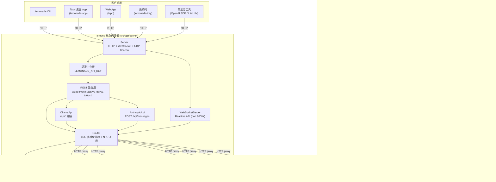
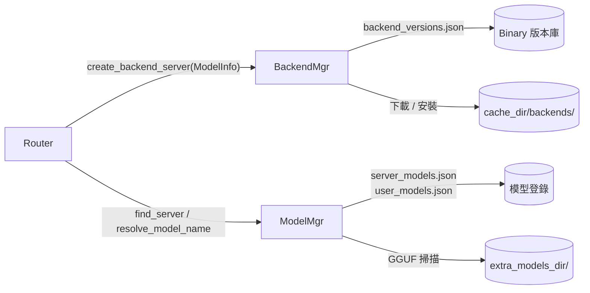
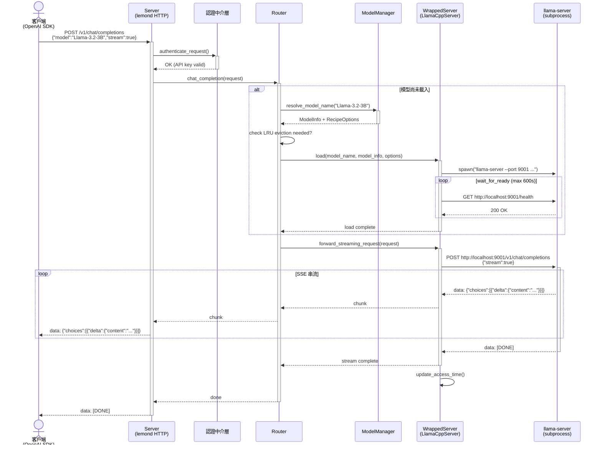

# Lemonade 系統架構文件

> 版本：10.2.0 | 文件日期：2026-04-25

---

## 1. 高層架構

Lemonade 採三層式架構：**客戶端層 → 伺服器核心（lemond）→ 後端子程序**。
單一 `lemond` 實例可同時服務多個來自不同機器的客戶端（one-server / many-clients 拓撲）。



### ModelManager / BackendManager / Router 三者關係



---

## 2. 元件清單

| 元件 | 職責 | 關鍵檔案／目錄 | 上游依賴 | 下游依賴 |
|------|------|---------------|---------|---------|
| **lemond** | HTTP 伺服器主進程，路由所有 API 請求 | `src/cpp/server/main.cpp` | OS / config.json | Router, ModelManager, BackendManager |
| **Server** | 建立 httplib::Server（IPv4+IPv6）、8 thread pool，設定 routes | `src/cpp/server/server.cpp` | cpp-httplib | Router, OllamaApi, AnthropicApi, WebSocketServer |
| **Router** | LRU 多模型調度、NPU 互斥排程、HTTP proxy 轉發 | `src/cpp/server/router.cpp`、`src/cpp/include/lemon/router.h` | ModelManager, BackendManager | WrappedServer 子類 |
| **ModelManager** | 模型登錄載入、下載、三層 alias 解析、硬體過濾 | `src/cpp/server/model_manager.cpp` | server_models.json, user_models.json | HuggingFace（libcurl）|
| **BackendManager** | 後端 binary 安裝、版本檢查、熱替換 | `src/cpp/server/backend_manager.cpp`、`src/cpp/include/lemon/backend_manager.h` | backend_versions.json | 檔案系統 |
| **WrappedServer** | 後端 abstract base class，subprocess 生命週期管理 | `src/cpp/include/lemon/wrapped_server.h` | ProcessManager, HttpClient | llama-server/flm/etc. |
| **LlamaCppServer** | GPU LLM 推論（Vulkan/ROCm/Metal/CPU） | `src/cpp/include/lemon/backends/llamacpp_server.h` | WrappedServer | llama-server subprocess |
| **FastFlowLMServer** | NPU LLM+Audio+Embeddings（AMD XDNA2） | `src/cpp/include/lemon/backends/fastflowlm_server.h` | WrappedServer | flm subprocess |
| **RyzenAIServer** | NPU 混合推論（Windows 獨佔） | `src/cpp/include/lemon/backends/ryzenaiserver.h` | WrappedServer | ryzenai-server subprocess |
| **WhisperServer** | ASR 語音轉錄 | `src/cpp/include/lemon/backends/whisper_server.h` | WrappedServer | whisper-server subprocess |
| **SDServer** | 圖像生成／編輯／變體 | `src/cpp/include/lemon/backends/sd_server.h` | WrappedServer | sd-server subprocess |
| **KokoroServer** | 文字轉語音（TTS） | `src/cpp/include/lemon/backends/kokoro_server.h` | WrappedServer | koko subprocess |
| **OllamaApi** | Ollama 相容 API adapter（`/api/*`） | `src/cpp/server/ollama_api.cpp` | Router | — |
| **AnthropicApi** | Anthropic 相容 API adapter（`POST /api/messages`） | `src/cpp/server/anthropic_api.cpp` | Router | — |
| **WebSocketServer** | OpenAI Realtime API（port 9000+） | `src/cpp/server/websocket_server.cpp`、`src/cpp/include/lemon/websocket_server.h` | libwebsockets, Router | RealtimeSession |
| **NetworkBeacon** | UDP 廣播，讓客戶端自動發現執行中的 lemond | `src/cpp/include/lemon/utils/network_beacon.h` | OS UDP socket | CLI / Tauri / Tray |
| **ConfigFile** | config.json 載入／儲存／版本遷移（shared_mutex 保護） | `src/cpp/include/lemon/config_file.h` | 檔案系統 | RuntimeConfig |
| **lemonade CLI** | 命令列客戶端（list/pull/run/status 等） | `src/cpp/cli/main.cpp` | NetworkBeacon, libcurl | lemond HTTP API |
| **Tauri App** | React 19 桌面 GUI，透過 tauriShim.ts 呼叫 Tauri invoke | `src/app/src/renderer/`、`src/app/src-tauri/` | Tauri v2 (Rust) | lemond HTTP API |
| **Web App** | 瀏覽器版 GUI，window.api 由 lemond 注入 mock | `src/web-app/`、`src/cpp/server/server.cpp:600+` | Webpack 5 | lemond HTTP API |
| **lemonade-tray** | 輕量系統列客戶端（macOS/Linux） | `src/cpp/tray/tray_app.cpp` | NetworkBeacon | lemond HTTP API |

---

## 3. 分層設計說明

### 3.1 API 層（多協定相容）

lemond 在同一個 HTTP server 上同時暴露三套相容協定，透過路由前綴區分：

**Quad-Prefix（OpenAI 相容）**

每個核心 endpoint 強制掛載在 4 個前綴下（`src/cpp/server/server.cpp:270-302`）：
```
/api/v0/<endpoint>   ← 舊版客戶端相容
/api/v1/<endpoint>   ← 目前主版本
/v0/<endpoint>       ← 舊版短路徑
/v1/<endpoint>       ← OpenAI SDK / LiteLLM 標準路徑
```
核心 endpoint 涵蓋：`chat/completions`、`completions`、`embeddings`、`reranking`、`models`、`health`、`pull`、`load`、`unload`、`audio/transcriptions`、`audio/speech`、`images/generations`、`images/edits`、`images/variations`、`responses`、`stats`、`system-info`、`logs/stream` 等。

**Ollama 相容（`/api/*`，無版本前綴）**

由 `OllamaApi::register_routes()` 掛載，格式轉換後委由 `Router` 處理：
`/api/chat`、`/api/generate`、`/api/tags`、`/api/embed`、`/api/ps` 等。

**Anthropic 相容**

`POST /api/messages` — 由 `AnthropicApi` 獨立處理，支援 tool use 及 SSE streaming。這是唯一不遵守 quad-prefix 規則的 endpoint。

### 3.2 Router 層（LRU 排程 + NPU 互斥）

`Router`（`src/cpp/server/router.cpp`）維護 `loaded_servers_: vector<unique_ptr<WrappedServer>>`，核心職責：

- **LRU 多模型管理**：每個 `WrappedServer` 維護 `last_access_time_`（`std::chrono::steady_clock`），推論後呼叫 `update_access_time()`。超過 `max_loaded_models` 上限時，以 `find_lru_server_by_type()` 找出最久未使用者進行 evict。
- **並發載入控制**：`load_mutex_` + `load_cv_` 確保同一時間只有一個 load 操作；load 期間釋放鎖以允許其他推論請求繼續。
- **Factory 模式**：`create_backend_server(ModelInfo)` 依據 recipe 名稱建立對應子類（`router.cpp:181-213`）。
- **Nuclear eviction**：非 404 的後端錯誤觸發全體 evict 並重試 load。

### 3.3 Backend Abstraction 層（WrappedServer）

```
ICapability (虛擬基底)
  ├─ ICompletionServer     chat_completion(), completion()
  ├─ IEmbeddingsServer     embeddings()
  ├─ IRerankingServer      reranking()
  ├─ IAudioServer          audio_transcriptions()
  ├─ ITextToSpeechServer   audio_speech()
  └─ IImageServer          image_generations(), image_edits(), image_variations()

WrappedServer : ICompletionServer
  ├─ LlamaCppServer   : WrappedServer, IEmbeddingsServer, IRerankingServer
  ├─ FastFlowLMServer : WrappedServer, IEmbeddingsServer, IAudioServer
  ├─ RyzenAIServer    : WrappedServer
  ├─ WhisperServer    : WrappedServer, IAudioServer
  ├─ SDServer         : WrappedServer, IImageServer
  └─ KokoroServer     : WrappedServer, ITextToSpeechServer
```

執行時能力檢查（`server_capabilities.h:72-75`）：
```cpp
template<typename T>
bool supports_capability(ICapability* server) {
    return dynamic_cast<T*>(server) != nullptr;
}
```

### 3.4 Subprocess 層（後端執行模型）

每個 `WrappedServer` 的 `load()` 會：
1. 以 `ProcessManager::spawn()` 啟動後端 binary（llama-server / flm / whisper-server 等）
2. 呼叫 `choose_port()` 取得 OS 指派的空閒 port
3. 以 `wait_for_ready()` polling 後端 `/health`（最長 600 秒）
4. 所有推論請求透過 `forward_request()` / `forward_streaming_request()` 以 HTTP proxy 方式轉發

---

## 4. 通訊模式

| 模式 | 使用情境 | 技術 |
|------|---------|------|
| **同步 HTTP** | chat/completions（非串流）、模型管理 API、health check | cpp-httplib 標準 request/response |
| **非同步 SSE 串流** | chat/completions（`stream: true`）、audio/speech | cpp-httplib Content-Provider + `text/event-stream` |
| **WebSocket Realtime API** | 即時語音轉錄（OpenAI Realtime 協定相容） | libwebsockets，獨立 port（9000+），透過 `/health` 的 `websocket_port` 欄位揭露 |
| **UDP Beacon 伺服器發現** | CLI / Tauri / Tray 自動發現執行中的 lemond | UDP 廣播，`NetworkBeacon`（`src/cpp/include/lemon/utils/network_beacon.h`） |
| **HTTP Proxy（內部）** | lemond → 後端子程序的推論請求轉發 | libcurl / cpp-httplib client，`forward_request()` |

**認證層次**：
- `LEMONADE_API_KEY`：一般 API 路由（`/api/*`、`/v0/*`、`/v1/*`）
- `LEMONADE_ADMIN_API_KEY`：完整存取（含 `/internal/*`）
- Internal endpoints 額外限制只允許 loopback（127.0.0.1 / ::1）存取

---

## 5. 關鍵設計決策與 Trade-off

### 5.1 Subprocess 而非 In-process 函式庫

**決策**：所有 AI 後端以獨立子程序執行，lemond 僅作 HTTP proxy。

**理由**：
- **故障隔離**：後端 OOM 或 crash 不影響 lemond 主進程穩定性
- **多語言相容**：後端可使用任何語言（Python/Rust/C++ 均可），只需暴露 HTTP API
- **熱替換**：可在不重啟 lemond 的情況下升級單一後端 binary（`apply_config_side_effects()`）
- **NPU 資源控制**：透過 process lifecycle 精確管控 NPU 記憶體，避免多 driver 競爭

**Trade-off**：增加首次載入延遲（`wait_for_ready()` 最長 600 秒）；每次推論多一層 HTTP 開銷（loopback，影響極小）。

### 5.2 NPU 互斥策略（FLM vs RyzenAI）

| Recipe | NPU 策略 | 原因 |
|--------|---------|------|
| `ryzenai-llm` | 完全獨佔 NPU | RyzenAI SDK 不支援 NPU 多租戶，獨占整塊 XDNA 計算資源 |
| `whispercpp`（NPU 模式） | 完全獨佔 NPU | 同上 |
| `flm` (FastFlowLM) | 分槽共享 NPU | XDNA2 支援多個 context，但每個 ModelType（LLM/Audio/Embedding）最多 1 個 FLM 實例 |

**FLM 共存規則**（`router.cpp:282-305`）：載入 FLM 時，若存在 RyzenAI 或 NPU 模式 Whisper 則全部 evict；若已有同 ModelType 的 FLM 則 evict 該槽；不同 ModelType 的 FLM 可共存。

### 5.3 Quad-Prefix 路由設計

**決策**：每個 endpoint 同時掛載 `/api/v0/`、`/api/v1/`、`/v0/`、`/v1/` 共 4 個前綴。

**理由**：
- `/v1/` 無 `/api` 前綴對應 OpenAI 官方 SDK 的預設 base URL（`https://api.openai.com/v1`）
- `/api/v1/` 供 LiteLLM 及原生 Lemonade 客戶端使用
- `v0` 版本確保舊版客戶端不中斷（forward compatibility）
- 統一由 `register_get` / `register_post` lambda 自動展開，無法遺漏（`server.cpp:270-302`）

### 5.4 Web App window.api Mock

lemond 在提供 Web App 時，將 mock `window.api` 直接注入 HTML `</head>` 前（`server.cpp:600+`），模擬 Tauri 的 invoke 合約。這讓同一份 React renderer 原始碼無修改地在 Tauri 和純瀏覽器環境中執行，避免維護兩套前端。

---

## 6. 核心流程 Sequence Diagram（Chat Completion 串流）



---

## 7. 平台差異

| 面向 | Windows | macOS | Linux |
|------|---------|-------|-------|
| **主進程** | `LemonadeServer.exe`（SUBSYSTEM:WINDOWS，嵌入 lemond + tray），開機自啟（startup folder） | `lemond` 獨立執行；`lemonade-tray` 為輕量客戶端 | `lemond` 獨立執行（或 systemd service `lemond.service`）；`lemonade-tray` 為輕量客戶端 |
| **桌面 GUI** | `lemonade-app.exe`（Tauri），隨需開啟，不管理 lemond 生命週期 | `lemonade-app`（Tauri），同左 | `lemonade-app`（Tauri），可打包為 AppImage |
| **TLS / SSL** | Schannel（Windows 內建） | SecureTransport（Apple 內建） | OpenSSL |
| **NPU 後端** | FLM（XDNA2）+ RyzenAI（XDNA）均可用 | 不支援 NPU 後端 | FLM（XDNA2）可用；RyzenAI 僅限 Windows |
| **GPU 後端** | llama.cpp（Vulkan / ROCm） | llama.cpp（Metal） | llama.cpp（Vulkan / ROCm） |
| **安裝包** | MSI（WiX 5.0+）：`wix_installer_minimal` / `wix_installer_full` | 已簽署 `.pkg`（`package-macos` target） | `.deb` / `.rpm`（CPack）；AppImage（Tauri bundle） |
| **建置 preset** | `windows`（VS 2022）/ `vs18`（VS 2026） | `default`（Ninja） | `default`（Ninja） |
| **平台 guards** | `#ifdef _WIN32` | `#ifdef __APPLE__` | `#ifdef __linux__` |
| **Tray 平台實作** | 嵌入於 `LemonadeServer.exe` | `src/cpp/tray/platform/` macOS 分支 | `src/cpp/tray/platform/` Linux 分支 |
| **Web App 打包** | 需手動執行 `web-app` target | CMake 自動建置（`BUILD_WEB_APP=ON` 預設） | CMake 自動建置（`BUILD_WEB_APP=ON` 預設） |

> **Linux AppImage 特殊情境**：AppImage 版本的設計目的是作為**遠端客戶端**，連接執行於其他機器的 `lemond`，而非本機執行伺服器。按照 Critical Invariant #11，per-client 狀態（設定、base URL、API key）必須儲存於客戶端本地，不得透過 lemond HTTP endpoint 集中管理。

---

## 附錄：RecipeOptions 三層繼承優先級

設定優先級（高 → 低），由 `RecipeOptions::inherit()` 實作（`src/cpp/include/lemon/recipe_options.h`）：

```
1. load 請求的 per-request options   ← 最高優先（非空值優先）
2. server_models.json 的 model_info.recipe_options
3. config.json 的全域 defaults        ← 最低優先
```

主要 keys：`ctx_size`（上下文視窗）、`gpu_layers`（GPU offload 層數）、`backend`（後端變體：vulkan/rocm/cpu/metal）、`args`（額外 CLI 參數）。
