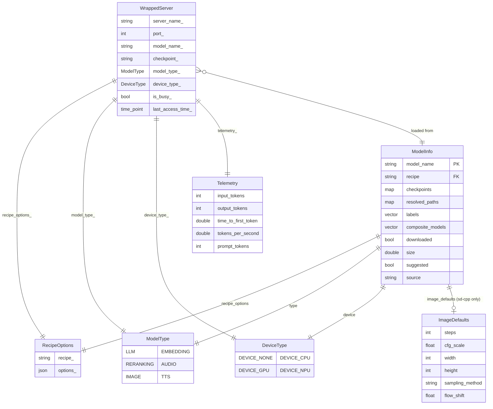

# Lemonade 資料模型與狀態管理文件

> 版本：10.2.0 | 更新日期：2026-04-25

---

## 1. 核心 Entity 清單

### 1.1 `ModelInfo` struct

**檔案**：`src/cpp/include/lemon/model_manager.h:64`

模型的完整描述，是整個系統中流通最廣的資料結構，從 Registry 載入後在 ModelManager、Router、WrappedServer 之間傳遞。

| 欄位 | 型別 | 說明 |
|------|------|------|
| `model_name` | `std::string` | Canonical 內部名稱（如 `Qwen3-0.6B-GGUF`） |
| `checkpoints` | `map<string,string>` | 各類型 checkpoint 路徑，key 為 `"main"`/`"mmproj"`/`"npu_cache"` 等，值為 `HF-repo:filename` 格式 |
| `resolved_paths` | `map<string,string>` | 對應到磁碟的絕對路徑（下載後填充） |
| `recipe` | `std::string` | 後端 recipe 識別字（`llamacpp`/`flm`/`whispercpp`/`sd-cpp`/`ryzenai-llm`/`kokoro`/`collection`） |
| `labels` | `vector<string>` | 功能標籤（`reasoning`/`audio`/`embedding`/`image`/`tts`/`vision`/`tool-calling` 等） |
| `composite_models` | `vector<string>` | 用於 `collection` recipe，列出子模型名稱 |
| `suggested` | `bool` | 是否為推薦模型（顯示於 UI 首位） |
| `source` | `std::string` | 來源標記（`"local_upload"` 表本地匯入） |
| `downloaded` | `bool` | 模型檔案是否已在本地磁碟就緒 |
| `size` | `double` | 模型大小（GB） |
| `recipe_options` | `RecipeOptions` | 此模型的推論設定（可被請求層覆蓋） |
| `type` | `ModelType` | LRU 管理分類（LLM/EMBEDDING/RERANKING/AUDIO/IMAGE/TTS） |
| `device` | `DeviceType` | 目標硬體設備 bitmask（CPU/GPU/NPU，可組合） |
| `image_defaults` | `ImageDefaults` | 圖像生成預設值（僅 `sd-cpp` recipe 有意義） |

**便利方法**：
- `checkpoint(type)` — 取得指定類型的 HF checkpoint 字串
- `resolved_path(type)` — 取得磁碟絕對路徑
- `mmproj()` — 快速存取多模態投影層 checkpoint

---

### 1.2 `RecipeOptions` class

**檔案**：`src/cpp/include/lemon/recipe_options.h`、`src/cpp/server/recipe_options.cpp`

封裝推論參數設定，支援三層繼承合併。內部以 `nlohmann::json options_` 儲存，按 recipe 限制可用 key。

**各 recipe 的有效 key**：

| recipe | 有效 key |
|--------|---------|
| `llamacpp` | `ctx_size`、`llamacpp_backend`、`llamacpp_args` |
| `whispercpp` | `whispercpp_backend`、`whispercpp_args` |
| `flm` | `ctx_size`、`flm_args` |
| `ryzenai-llm` | `ctx_size` |
| `sd-cpp` | `sd-cpp_backend`、`sdcpp_args`、`steps`、`cfg_scale`、`width`、`height`、`sampling_method`、`flow_shift` |

**三層繼承優先級**（高 → 低）：
```
請求層 options  >  server_models.json 中的 recipe_options  >  config.json 全域 defaults
```

`RecipeOptions::inherit(other)` 將 `this` 中的非空值覆蓋 `other` 的對應值，回傳合併結果。

---

### 1.3 `Telemetry` struct

**檔案**：`src/cpp/include/lemon/wrapped_server.h:22`

每次推論後由 `WrappedServer` 收集，透過 `/api/v1/stats` 端點對外暴露。

| 欄位 | 型別 | 說明 |
|------|------|------|
| `input_tokens` | `int` | 本次請求輸入 token 數 |
| `output_tokens` | `int` | 本次請求輸出 token 數 |
| `time_to_first_token` | `double` | 首 token 延遲（秒） |
| `tokens_per_second` | `double` | 推論速度（tokens/s） |
| `decode_token_times` | `vector<double>` | 每個 decode token 的時間序列（用於細粒度分析） |
| `prompt_tokens` | `int` | 來自 `usage.prompt_tokens` 的數值（含 cached tokens） |

---

### 1.4 `DownloadProgress` struct

**檔案**：`src/cpp/include/lemon/model_manager.h:35`

下載進度狀態，透過 `DownloadProgressCallback` 回呼傳遞，伺服器以 SSE 格式推送給客戶端。

| 欄位 | 型別 | 說明 |
|------|------|------|
| `file` | `std::string` | 當前下載的檔案名稱 |
| `file_index` | `int` | 當前檔案索引（1-based） |
| `total_files` | `int` | 本次下載的總檔案數 |
| `bytes_downloaded` | `size_t` | 當前檔案已下載位元組數 |
| `bytes_total` | `size_t` | 當前檔案總大小（位元組） |
| `total_download_size` | `size_t` | 整批下載的總位元組數 |
| `bytes_previously_downloaded` | `size_t` | 斷點續傳或已略過檔案的位元組數 |
| `percent` | `int` | 整體進度百分比（0–100） |
| `complete` | `bool` | 所有下載完成時為 `true` |
| `error` | `std::string` | 失敗訊息（失敗時非空） |

---

### 1.5 `RuntimeConfig` class

**檔案**：`src/cpp/include/lemon/runtime_config.h`

全域設定單例，執行時持有 config.json 的完整狀態。使用 `std::shared_mutex` 保證執行緒安全讀寫。

| 方法分組 | 說明 |
|---------|------|
| `port()`、`host()`、`log_level()` 等 | 頂層設定的 typed getter（共享鎖） |
| `backend_config(name)` | 取得後端設定的 JSON 子樹（`llamacpp`/`whispercpp` 等） |
| `recipe_options()` | 將巢狀設定轉為 RecipeOptions 期望的扁平格式 |
| `set(changes, callback)` | 驗證並套用變更，觸發 `ConfigSideEffectCallback` |
| `snapshot()` | 回傳完整設定的 JSON 快照 |
| `set_global()` / `global()` | 設定/取得全域單例指標 |

---

## 2. 資料關係圖（Mermaid erDiagram）



---

## 3. Config.json Schema 摘要

### 3.1 頂層欄位

**載入邏輯**：`src/cpp/include/lemon/config_file.h`、`src/cpp/server/config_file.cpp`

| Key | Type | Default | 說明 |
|-----|------|---------|------|
| `port` | int | 13305 | HTTP server 綁定 port |
| `host` | string | `"localhost"` | 綁定地址，`"0.0.0.0"` 開放所有介面 |
| `websocket_port` | int | 0 | WebSocket Realtime API port（0=OS 自動指派） |
| `log_level` | string | `"info"` | 日誌等級：trace/debug/info/warning/error/fatal/none |
| `global_timeout` | int | 300 | HTTP/推論/就緒等待 timeout（秒） |
| `max_loaded_models` | int | 1 | 每個 ModelType 的最大同時載入數，`-1`=無限制 |
| `no_broadcast` | bool | false | 停用 UDP 服務發現廣播 |
| `extra_models_dir` | string | `""` | 額外 GGUF 檔案掃描目錄 |
| `models_dir` | string | `"auto"` | HuggingFace cache 目錄（auto=平台預設） |
| `ctx_size` | int | 4096 | LLM 全域預設 context 視窗大小 |
| `offline` | bool | false | 跳過所有網路請求（下載、版本檢查） |
| `no_fetch_executables` | bool | false | 不自動下載後端可執行檔 |
| `disable_model_filtering` | bool | false | 顯示所有模型，不依硬體可用性過濾 |
| `enable_dgpu_gtt` | bool | false | 將 GTT 記憶體納入 VRAM 計算 |
| `rocm_channel` | string | `"stable"` | ROCm 版本通道（stable/preview/nightly） |

### 3.2 後端設定子區塊

每個後端都有一個同名子物件。`*_bin` 欄位接受：`"builtin"`（內建釘選版）、`"latest"`（最新 release）、具體版本號（如 `"b8766"`）、或本地 binary 目錄路徑。

各後端子物件共用的欄位模式（以 `llamacpp` 為代表）：

| Key | Type | Default | 說明 |
|-----|------|---------|------|
| `bin` | string | `"builtin"` | server binary 來源 |
| `backend` | string | `"auto"` | 計算後端（vulkan/rocm-stable/npu/cpu 等，依後端而異） |
| `args` | string | `""` | 額外 CLI 參數直接傳給子程序 |
| `ctx_size` | int | — | llamacpp/flm/ryzenai 專用 context 大小（覆蓋頂層） |

`flm`、`ryzenai`、`kokoro` 區塊結構相似，各含 `bin` 欄位。`sdcpp` 額外含 `steps`、`cfg_scale`、`width`、`height`、`sampling_method`、`flow_shift` 等圖像生成預設值。

### 3.3 平台預設路徑

| 平台 | config.json 路徑 |
|------|----------------|
| Linux (systemd) | `/var/lib/lemonade/.cache/lemonade/config.json` |
| Linux (standalone) | `~/.cache/lemonade/config.json` |
| Windows | `%USERPROFILE%\.cache\lemonade\config.json` |
| macOS | `/Library/Application Support/lemonade/.cache/config.json` |

---

## 4. Model Registry 結構

### 4.1 `server_models.json` Schema

**檔案**：`src/cpp/resources/server_models.json`（165 筆記錄，受版本控制）

**分佈**：ryzenai-llm 79 筆、llamacpp 66 筆、sd-cpp 11 筆、whispercpp 6 筆、collection 2 筆、kokoro 1 筆

頂層結構為一個 JSON 物件，key 為模型公開名稱，value 為模型描述物件。

**單一 checkpoint 模型**（llamacpp）：
```json
"Qwen3-0.6B-GGUF": {
  "checkpoint": "unsloth/Qwen3-0.6B-GGUF:Q4_0",
  "recipe": "llamacpp",
  "suggested": true,
  "labels": ["reasoning"],
  "size": 0.38
}
```

**多 checkpoint 模型**（whispercpp，含 NPU cache）：
```json
"Whisper-Tiny": {
  "checkpoints": {
    "main": "ggerganov/whisper.cpp:ggml-tiny.bin",
    "npu_cache": "amd/whisper-tiny-onnx-npu:ggml-tiny-encoder-vitisai.rai"
  },
  "recipe": "whispercpp",
  "labels": ["audio", "transcription"],
  "size": 0.075
}
```

**含 image_defaults 的模型**（sd-cpp）：
```json
"SD-Turbo": {
  "checkpoint": "stabilityai/sd-turbo:sd_turbo.safetensors",
  "recipe": "sd-cpp",
  "labels": ["image"],
  "size": 5.2,
  "image_defaults": {
    "steps": 4, "cfg_scale": 1.0,
    "width": 512, "height": 512
  }
}
```

**Collection 模型**（聚合多個子模型）：
```json
"Ultra Collection": {
  "checkpoint": "",
  "recipe": "collection",
  "composite_models": [
    "Qwen3.5-35B-A3B-GGUF", "Flux-2-Klein-9B-GGUF",
    "Whisper-Large-v3-Turbo", "kokoro-v1"
  ]
}
```

**完整 schema 欄位清單**：

| 欄位 | 必填 | 說明 |
|------|------|------|
| `checkpoint` | 擇一 | 單一 checkpoint（`HFRepo:filename` 格式） |
| `checkpoints` | 擇一 | 多 checkpoint 物件（key: main/mmproj/npu_cache 等） |
| `recipe` | 是 | 後端 recipe 名稱 |
| `labels` | 是 | 功能標籤陣列 |
| `suggested` | 否 | 是否推薦 |
| `size` | 否 | 模型大小（GB） |
| `recipe_options` | 否 | 模型層級推論設定 |
| `composite_models` | 僅 collection | 子模型名稱清單 |
| `image_defaults` | 僅 sd-cpp | 圖像生成預設參數 |

### 4.2 `user_models.json` 與 `server_models.json` 的差異

**路徑**：`{cache_dir}/user_models.json`（使用者本地，不受版本控制）

| 面向 | `server_models.json` | `user_models.json` |
|------|---------------------|-------------------|
| 位置 | `src/cpp/resources/`（版本控制） | cache dir（本地，跨版本保留） |
| 來源 | Lemonade 維護團隊 | 使用者透過 `lemonade pull user.XXX` 或 UI 匯入 |
| 更新方式 | 軟體升級時替換 | 使用者操作或 `register_user_model()` |
| 覆蓋語意 | 以 `source = ""` 標記 | 以 `source = "local_upload"` 標記 |
| 識別前綴 | 無特殊前綴 | 慣例以 `user.` 為前綴 |

**優先合併順序**（`ModelManager::build_cache()`）：
1. `server_models.json`（基底）
2. `user_models.json`（使用者新增或覆蓋）
3. `recipe_options.json`（使用者儲存的每模型推論設定）
4. `discover_extra_models()`（掃描 `extra_models_dir` 的 GGUF 檔案）

---

## 5. State Management

### 5.1 `Router::loaded_servers_` 的狀態轉換

**檔案**：`src/cpp/server/router.cpp`

```
              Router::load_model()
                      │
          ┌───────────▼───────────────────────┐
          │  NPU 互斥檢查 / LRU 容量檢查       │
          │  evict_lru_server() / evict_all()  │
          └───────────┬───────────────────────┘
                      │
          ┌───────────▼───────────────────────┐
          │  create_backend_server()           │
          │  → 建立 WrappedServer 實例         │
          └───────────┬───────────────────────┘
                      │
          ┌───────────▼───────────────────────┐
          │  LOADING（子程序啟動中）            │
          │  new_server->load()               │  ← 最長 600 秒
          │  wait_for_ready() polling health  │
          └───────────┬───────────────────────┘
                      │ 成功
          ┌───────────▼───────────────────────┐
          │  IDLE（就緒，在 loaded_servers_）  │
          │  is_busy_ = false                 │
          │  last_access_time_ = now()        │
          └───────────┬───────────────────────┘
                      │ 有請求進來
          ┌───────────▼───────────────────────┐
          │  BUSY（推論進行中）                │
          │  set_busy(true)                   │
          │  update_access_time()             │
          └───────────┬───────────────────────┘
                      │ 推論完成
          ┌───────────▼───────────────────────┐
          │  IDLE（推論完成）                  │
          │  set_busy(false)                  │
          │  busy_cv_.notify_all()            │
          └───────────┬───────────────────────┘
                      │ 被 LRU 選中 / nuclear option
          ┌───────────▼───────────────────────┐
          │  EVICTING（等待推論完成後卸載）     │
          │  wait_until_not_busy()            │
          │  server->unload()                 │
          │  loaded_servers_.erase()          │
          └───────────────────────────────────┘
```

**並發保護**：
- `load_mutex_`（`std::mutex`）+ `is_loading_`（bool）+ `load_cv_`（`std::condition_variable`）：保證同一時間只有一個 load 操作
- `busy_mutex_`（`std::mutex`）+ `busy_cv_`（`std::condition_variable`）：保護 `is_busy_` 讀寫

### 5.2 NPU 互斥排程規則

| 後端 recipe | 載入策略 |
|------------|---------|
| `ryzenai-llm` | 驅逐所有 NPU 後端（完全獨佔） |
| `whispercpp`（NPU backend） | 驅逐所有 NPU 後端（完全獨佔） |
| `flm` | 允許不同 ModelType 的 FLM 共存；同 ModelType 最多 1 個；遇到 exclusive-NPU 後端則驅逐之 |

---

## 6. 資料生命週期

### 6.1 模型資料生命週期

```
[server_models.json / user_models.json]
           │
           │  ModelManager::build_cache()
           ▼
   models_cache_（map<string, ModelInfo>）
           │
           │  download_registered_model() ─── libcurl / flm subprocess
           │  DownloadProgress callback → SSE → 客戶端
           ▼
   本地磁碟（HF cache dir）
   ModelInfo.downloaded = true
   ModelInfo.resolved_paths 填充
           │
           │  Router::load_model()
           │  RecipeOptions 三層合併
           ▼
   WrappedServer（子程序啟動）
   loaded_servers_.push_back(server)
   狀態：IDLE
           │
           │  推論請求到達
           ▼
   狀態：BUSY → 轉發 HTTP proxy → 後端子程序
   Telemetry 更新
           │
           │  LRU 容量超限 / 手動 unload / nuclear option
           ▼
   WrappedServer::unload()（子程序終止）
   loaded_servers_.erase()
   （ModelInfo 仍在 cache，模型檔案仍在磁碟）
           │
           │  delete_model()
           ▼
   磁碟檔案刪除
   ModelInfo.downloaded = false
```

### 6.2 Config 資料生命週期

```
[程式碼內建 defaults]
    src/cpp/server/config_file.cpp — get_defaults()
    Linux 可由 /usr/share/lemonade/defaults.json 覆蓋
           │
           │  config.json 不存在時
           │  migrate_from_env()：讀取 LEMONADE_PORT 等 legacy 環境變數
           ▼
[config.json 載入]
    ConfigFile::load(cache_dir)
    deep-merge defaults + 保留 unknown keys
           │
           │  CLI 參數（--port / --host）
           │  自動持久化回 config.json
           ▼
[RuntimeConfig 單例建立]
    RuntimeConfig::set_global(instance)
    元件透過 config_ 指標存取
           │
           │  執行時動態更新
           │  lemonade config set key=value
           │  或 POST /internal/set
           ▼
[RuntimeConfig::set(changes, callback)]
    validate() 驗證合法性
    apply_changes() 計算 diff
    ConfigFile::save() → atomic temp+rename 寫入 config.json
    ConfigSideEffectCallback 觸發：
      port/host → rebind HTTP
      log_level → AixLog 重設
      extra_models_dir → ModelManager 更新
      *_bin → 後端 binary 熱替換
```

---

## 7. 附錄：`backend_versions.json` 版本釘選

**檔案**：`src/cpp/resources/backend_versions.json`

釘定各後端在各硬體 variant 下的版本。`clear_bin_if_lemonade_below` 欄位指示低於該版本的舊版 lemonade 需清除已下載的 binary。

| 後端 | Variants | 當前釘定版本（示例） |
|------|---------|-----------------|
| `llamacpp` | vulkan/rocm-stable/rocm-preview/rocm-nightly/metal/cpu | b8766 / b8653 |
| `whispercpp` | cpu/vulkan/rocm/npu | v1.8.2 |
| `sd-cpp` | cpu/rocm-stable/rocm-preview | master-569-ab6afe8 |
| `ryzenai-llm` | npu | v1.7.0 |
| `flm` | npu | v0.9.39 |
| `kokoro` | cpu | b16 |
