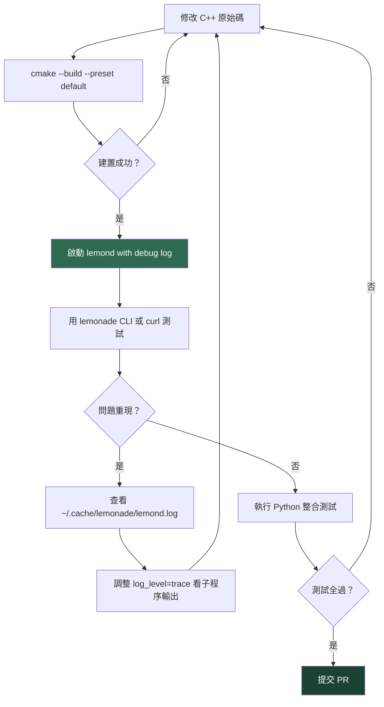

# Lemonade 開發者完整上手指南

> 版本：10.2.0 | 更新：2026-04-25

---

## 目錄

1. [Prerequisites](#1-prerequisites)
2. [環境建置 Step-by-Step](#2-環境建置-step-by-step)
3. [本地開發 Workflow](#3-本地開發-workflow)
4. [測試策略](#4-測試策略)
5. [Debugging 技巧](#5-debugging-技巧)
6. [Contribution Workflow](#6-contribution-workflow)
7. [Critical Invariants](#7-critical-invariants)

---

## 1. Prerequisites

### Windows

| 工具 | 版本需求 | 備注 |
|------|----------|------|
| Visual Studio | 2022 或 2026 | 需含 C++ workload |
| CMake | 3.28+ | 建議加入 PATH |
| Git | 任意新版 | FetchContent 需要 |
| Node.js | 20+ | 僅 Tauri/Web app |
| Rust (rustup) | stable | 僅 Tauri app |
| WiX Toolset | 5.0.2 | 僅打包 MSI |

> Rust 安裝後需確認 `%USERPROFILE%\.cargo\bin` 已加入 PATH。若出現 `link.exe` 錯誤，請從 Visual Studio Developer Shell 執行。

### Linux (Ubuntu 24.04 / Fedora)

| 工具 | 版本需求 | 安裝方式 |
|------|----------|----------|
| GCC 或 Clang | C++17 相容 | `apt install g++` |
| CMake | 3.28+ | `apt install cmake` |
| Ninja | 任意版本（推薦）| `apt install ninja-build` |
| libssl-dev | — | `apt install libssl-dev` |
| Node.js | 20+（可選）| 僅 Tauri/Web app |
| Rust | stable（可選）| 僅 Tauri app |
| AppIndicator3 | GTK3（可選）| 僅 lemonade-tray |

### macOS（Beta）

| 工具 | 版本需求 | 安裝方式 |
|------|----------|----------|
| Xcode Command Line Tools | — | `xcode-select --install` |
| CMake | 3.28+ | Homebrew 或官網 |
| Ninja | 推薦 | `brew install ninja` |
| Node.js | 20+（可選）| 僅 Tauri/Web app |
| Rust | stable（可選）| 僅 Tauri app |

---

## 2. 環境建置 Step-by-Step

### 2.1 Clone 儲存庫

```bash
git clone https://github.com/lemonade-sdk/lemonade.git
cd lemonade
```

### 2.2 執行 Setup 腳本

腳本會自動偵測平台、安裝缺少的系統相依套件，並建立 `build/` 目錄。

```bash
# Linux / macOS
./setup.sh

# Windows (PowerShell)
./setup.ps1
```

> 首次執行需要網路連線，CMake FetchContent 會下載 cpp-httplib、nlohmann/json、CLI11、libcurl、zstd 等相依套件。

### 2.3 建置 C++ 伺服器

```bash
# Linux / macOS
cmake --build --preset default

# Windows (Visual Studio 2022)
cmake --build --preset windows

# Windows (Visual Studio 2026)
cmake --build --preset vs18
```

### 2.4 建置產出確認

| 平台 | 執行檔 | 說明 |
|------|--------|------|
| Linux/macOS | `build/lemond` | HTTP 伺服器主體 |
| Linux/macOS | `build/lemonade` | CLI 客戶端 |
| Linux/macOS | `build/lemonade-tray` | 系統列托盤（有 AppIndicator3 才存在）|
| Windows | `build/Release/lemond.exe` | HTTP 伺服器主體 |
| Windows | `build/Release/LemonadeServer.exe` | 內嵌伺服器 + 系統列 GUI |
| Windows | `build/Release/lemonade.exe` | CLI 客戶端 |

資源檔自動複製至 `build/resources/`（Linux/macOS）或 `build/Release/resources/`（Windows）。

### 2.5 驗證建置成功

```bash
# Linux/macOS
./build/lemond --version
./build/lemonade --version

# Windows
.\build\Release\lemond.exe --version
.\build\Release\lemonade.exe --version
```

### 2.6 建置 Tauri 桌面 App（可選）

```bash
# 需先安裝 Node.js 20+ 與 Rust
# Linux/macOS
cmake --build --preset default --target tauri-app

# Windows
cmake --build --preset windows --target tauri-app
```

> 初次建置會下載 ~80 個 Rust crate，需數分鐘。僅做前端 UI 迭代時，建議使用 `cd src/app && npm run dev` 熱重載（<1s 每次變更）。

---

## 3. 本地開發 Workflow



### 3.1 啟動 lemond（含 debug 日誌）

```bash
# 直接啟動，設定 debug 等級
./build/lemond --port 13305

# 啟動後動態設定 log level（不需重啟）
curl -X POST http://localhost:13305/internal/set \
  -H "Content-Type: application/json" \
  -d '{"log_level": "debug"}'

# 或使用 CLI
./build/lemonade config set log_level=debug
```

日誌寫入 `~/.cache/lemonade/lemond.log`，也可串流：

```bash
./build/lemonade logs          # 開啟日誌串流
# 或直接監聽 WebSocket
curl http://localhost:13305/api/v1/logs/stream
```

### 3.2 使用 lemonade CLI 測試

```bash
./build/lemonade status                          # 伺服器狀態
./build/lemonade list                            # 可用模型
./build/lemonade pull Llama-3.2-1B-Instruct-CPU  # 下載模型
./build/lemonade run Llama-3.2-1B-Instruct-CPU   # 執行並開啟 Web UI
./build/lemonade backends                        # 列出後端版本
```

### 3.3 直接使用 curl / Python 測試 API

```bash
# 健康檢查
curl http://localhost:13305/api/v1/health

# 列出已載入模型
curl http://localhost:13305/api/v1/models

# Chat completion
curl -X POST http://localhost:13305/v1/chat/completions \
  -H "Content-Type: application/json" \
  -d '{"model":"Llama-3.2-1B-Instruct-CPU","messages":[{"role":"user","content":"hello"}]}'

# 查看目前完整設定
curl http://localhost:13305/internal/config
```

Python 版本：

```python
from openai import OpenAI
client = OpenAI(base_url="http://localhost:13305/v1", api_key="none")
resp = client.chat.completions.create(
    model="Llama-3.2-1B-Instruct-CPU",
    messages=[{"role": "user", "content": "Hello"}]
)
print(resp.choices[0].message.content)
```

### 3.4 熱替換後端 Binary

後端 binary 路徑可在不重啟 lemond 的情況下更換：

```bash
# 指定本地自訂 llama-server binary
curl -X POST http://localhost:13305/internal/set \
  -H "Content-Type: application/json" \
  -d '{"llamacpp_bin": "/path/to/your/llama-server"}'
```

`*_bin` 欄位值：
- `"builtin"` — 使用內建穩定版
- `"latest"` — 解析最新 GitHub release
- `"v1.8.2"` — 釘選特定版本
- `"/path/to/dir"` — 本地自訂 binary（立即生效）

---

## 4. 測試策略

### 4.1 測試分層

| 層級 | 測試檔案 | 需要推論後端？ | 執行時間 |
|------|----------|--------------|----------|
| CLI 功能 | `test/server_cli.py` | 否 | 快速（秒級）|
| API 端點 | `test/server_endpoints.py` | 否 | 快速（秒級）|
| Ollama 相容 | `test/test_ollama.py` | 否 | 快速 |
| 環境變數 | `test/server_env_vars.py` | 否 | 快速 |
| 串流錯誤 | `test/server_streaming_errors.py` | 否 | 快速 |
| LLM 推論 | `test/server_llm.py` | 是（llamacpp/flm/ryzenai）| 分鐘級 |
| 語音轉錄 | `test/server_whisper.py` | 是（whispercpp/flm）| 分鐘級 |
| 圖像生成 | `test/server_sd.py` | 是（sdcpp）| 2–3 分鐘/張 |
| 文字轉語音 | `test/server_tts.py` | 是（kokoro）| 分鐘級 |

### 4.2 安裝測試相依套件

```bash
pip install -r test/requirements.txt
# 包含：requests, httpx, openai, huggingface_hub, psutil, numpy, websockets, ollama
```

### 4.3 執行各類型測試

```bash
# 不需推論後端的測試（CI 標準跑法）
python test/server_cli.py
python test/server_endpoints.py
python test/test_ollama.py
python test/server_streaming_errors.py

# LLM 推論測試（需指定後端和設備）
python test/server_llm.py --wrapped-server llamacpp --backend vulkan
python test/server_llm.py --wrapped-server llamacpp --backend rocm
python test/server_llm.py --wrapped-server flm --backend npu

# 語音轉錄
python test/server_whisper.py --wrapped-server whispercpp --backend cpu

# 圖像生成（很慢，CPU 約 2–3 分鐘）
python test/server_sd.py

# 指定自訂 server binary
python test/server_cli.py --server-binary /path/to/lemonade-server
```

測試框架會自動從 `build/` 目錄探索 server binary。

### 4.4 CI/CD 測試矩陣

CI 在 `push`、`pull_request`、`merge_group` 觸發，分以下 job 群組：

| 類別 | Job | Platform | 說明 |
|------|-----|----------|------|
| 建置 | `build-lemonade-server-installer` | `windows-latest` | MSI 安裝包 |
| 建置 | `build-lemonade-deb` | Ubuntu 24.04 container | .deb 套件 |
| 建置 | `build-lemonade-rpm` | Fedora container | .rpm 套件 |
| 建置 | `build-lemonade-macos-dmg` | `macos-latest` | .pkg + Tauri |
| 無 GPU 測試 | `test-cli-endpoints-linux` | `ubuntu-latest` | cli / endpoints / ollama / streaming-errors / env-vars |
| 無 GPU 測試 | `test-cli-endpoints` | `windows-latest` + `macos-latest` | 同上 |
| 推論測試 | `test-exe-inference` | 自管 Windows GPU/NPU | llamacpp(vulkan/rocm)、ryzenai、flm、whisper、SD、TTS |
| 推論測試 | `test-deb-inference` | 自管 Linux GPU/NPU | llamacpp(vulkan/rocm)、flm、whisper、SD、TTS |
| 發布 | `sign-msi-installers` + `release` | tag `v*` 才執行 | SignPath 簽署 + GitHub Release |

---

## 5. Debugging 技巧

### 5.1 設定 log_level=trace 看子程序完整輸出

```bash
# 設定最詳細日誌（trace 包含後端 subprocess 的所有輸出）
./build/lemonade config set log_level=trace

# 即時追蹤
tail -f ~/.cache/lemonade/lemond.log
```

日誌等級由低到高：`trace > debug > info > warning > error > fatal > none`

### 5.2 直接測試後端 HTTP API（繞過 lemond）

llama-server 本身也是 HTTP 伺服器，可直接測試：

```bash
# 查出 llama-server 監聽的 port（在 debug log 中找）
# 通常在 13306+ 範圍
curl http://localhost:13306/v1/chat/completions \
  -H "Content-Type: application/json" \
  -d '{"model":"...","messages":[{"role":"user","content":"test"}]}'
```

透過 `disable_model_filtering=true` 強制顯示所有模型（不依硬體過濾）：

```bash
./build/lemonade config set disable_model_filtering=true
```

### 5.3 追蹤 Router NPU eviction 邏輯

NPU eviction 邏輯在 `/home/user/lemonade/src/cpp/server/router.cpp`。

關鍵行為：
- `ryzenai-llm` 與 `whispercpp-npu` 獨佔整個 NPU（會驅逐所有其他 NPU 模型）
- `flm` 可與其他 FLM type 共存（最多同時 1 個 LLM + 1 個 STT + 1 個 embedding）
- 非 NPU 錯誤觸發「nuclear option」：驅逐全部模型再重試

設定 `log_level=debug` 後，Router 每次做 eviction 決策都會輸出詳細日誌。

```bash
# 查看目前已載入的模型與其 NPU 狀態
curl http://localhost:13305/api/v1/models
curl http://localhost:13305/api/v1/stats
```

### 5.4 常見踩坑

**NPU driver 問題**

systemd 服務環境與使用者 shell 環境不同，NPU driver 路徑可能不在 `PATH` 中：

```bash
# 參考 GitHub issue #1358
# 解法：在 systemd unit 的 [Service] 段落明確設定 Environment
# 或使用 SIGHUP 讓 lemond 重新掃描硬體（不重啟）
kill -HUP $(pidof lemond)
```

**systemd 環境變數缺失**

systemd service 不繼承使用者的 `~/.bashrc` 環境。需要在 `/etc/systemd/system/lemond.service` 內 `[Service]` 加入：

```ini
Environment="PATH=/opt/bin:/usr/local/bin:/usr/bin:/bin"
```

**port 衝突**

lemond 預設綁定 `localhost:13305`。若需要對外服務：

```bash
./build/lemonade config set host=0.0.0.0
# 警告：需同步設定 LEMONADE_API_KEY 避免未授權存取
```

**Windows Cargo PATH 問題**

若 Rust 指令找不到，確認 `%USERPROFILE%\.cargo\bin` 在 PATH 中，並從 Visual Studio Developer Shell 執行。

**config.json 位置（各平台）**

| 平台 | 路徑 |
|------|------|
| Linux (standalone) | `~/.cache/lemonade/config.json` |
| Linux (systemd) | `/var/lib/lemonade/.cache/lemonade/config.json` |
| Windows | `%USERPROFILE%\.cache\lemonade\config.json` |
| macOS | `/Library/Application Support/lemonade/.cache/config.json` |

---

## 6. Contribution Workflow

### 6.1 分支策略

```
main          ← 穩定分支，PR 合併目標
feature/xxx   ← 新功能
fix/xxx       ← Bug 修復
```

**重大 PR 前必須先開 Issue 討論**。UI/前端變更由核心 maintainer 處理，不要直接送 PR 修改 `src/app/src/renderer/` 或 `src/web-app/` 的元件。

### 6.2 Code Style

**C++**
- 標準：C++17，所有程式碼在 `lemon::` namespace 內
- 命名：函式/變數用 `snake_case`；類別/型別用 `CamelCase`
- 縮排：**4 個空格**（不用 tab）
- Header guard：`#pragma once`
- `#include` 在每個 block 內依**字母順序**排列

```cpp
// 正確範例
#include <algorithm>
#include <string>
#include <vector>

#include "lemon/model_types.h"
#include "lemon/router.h"
```

**Python**
- 使用 **Black 26.1.0** 格式化（CI 強制檢查）
- Pylint 靜態分析（`.pylintrc`）

**TypeScript / React**
- React 19，純 CSS（dark theme）
- 僅核心 maintainer 處理

### 6.3 Pre-commit Hooks

安裝並使用 pre-commit：

```bash
pip install pre-commit
pre-commit install
```

Hooks（定義於 `.pre-commit-config.yaml`）：
- `trailing-whitespace` — 去除行尾空白
- `end-of-file-fixer` — 確保檔案末尾有換行
- `check-yaml` — 驗證 YAML 語法
- `check-added-large-files` — 禁止大檔案（排除 `.svg`）
- `black` (26.1.0) — Python 格式化

### 6.4 PR 要求

1. 確認 CI 全部 job 通過（lint、format、build、integration test）
2. 新增 API endpoint 必須在 4 個 prefix 下全部註冊（見 Section 7）
3. 新增後端必須實作所有 `WrappedServer` 抽象方法
4. 不可移除 `/api/` Ollama 相容端點
5. 不可在 `lemond` 端新增 per-client 設定（違反 Critical Invariant #11）

---

## 7. Critical Invariants

這些規則在**所有**程式碼變更中必須嚴格遵守。

### 7.1 Quad-prefix 路由（強制）

每個新 API endpoint 必須在以下 4 個 prefix 下全部註冊：

```cpp
// 正確做法（src/cpp/server/server.cpp）
for (const auto& prefix : {"/api/v0/", "/api/v1/", "/v0/", "/v1/"}) {
    svr.Post(prefix + "your/endpoint", handler);
}
```

遺漏任一 prefix 會破壞向下相容性（舊版客戶端使用 `/api/v0/`，OpenAI SDK 使用 `/v1/`）。

### 7.2 NPU 互斥（勿破壞）

```
ryzenai-llm, whispercpp-npu  ──→  獨佔 NPU（驅逐所有其他 NPU 模型）
flm                          ──→  可與同類型 FLM 共存（最多 1 LLM + 1 STT + 1 embedding）
```

Router 邏輯在 `/home/user/lemonade/src/cpp/server/router.cpp`。修改路由邏輯時必須確保此互斥行為不被破壞。

### 7.3 Subprocess Model（後端絕對不可 in-process）

所有後端（llama-server、flm、ryzenai-server、whisper-server、sd-server、koko）**必須以子程序**執行。Lemonade 透過 HTTP proxy 轉發請求。

禁止：將任何後端 library 直接 link 進 lemond 並 in-process 呼叫。

### 7.4 Per-client 設定不放在 lemond

客戶端的偏好設定（API URL、API key、theme、layout、zoom）必須儲存在客戶端本地：

| 客戶端 | 儲存位置 |
|--------|----------|
| Tauri app | `app_settings.json`（Tauri 本地存儲）|
| Web app | `localStorage`（key: `lemonade-settings`）|
| CLI | 環境變數 + 命令列參數 |

**不可**在 `lemond` 新增任何 HTTP endpoint 來儲存或讀取客戶端偏好設定。

### 7.5 Web-app 套件分離（不合併 package.json）

`src/app/package.json`（Tauri 桌面 app）與 `src/web-app/package.json`（瀏覽器版 Web app）**必須保持分開**。

原因：原生 Debian 套件（`.deb`）建置時使用 `/usr/share/nodejs` 下的系統套件，只有 `src/web-app/` 的相依性符合此約束。合併 `package.json` 會破壞可重現的發行版打包。

### 7.6 跨平台編譯

所有 C++ 程式碼必須同時在 Windows (MSVC)、Linux (GCC/Clang)、macOS (AppleClang) 編譯通過。平台特定程式碼必須使用 ifdef：

```cpp
#ifdef _WIN32
    // Windows only
#elif defined(__APPLE__)
    // macOS only
#elif defined(__linux__)
    // Linux only
#endif
```

不可 hardcode 路徑，一律使用 `path_utils` 工具函式。

---

## 快速參考

| 目標 | 指令 |
|------|------|
| 建置 C++ | `cmake --build --preset default` |
| 啟動伺服器 | `./build/lemond` |
| 開啟 debug 日誌 | `./build/lemonade config set log_level=debug` |
| 執行 CLI 測試 | `python test/server_cli.py` |
| 執行端點測試 | `python test/server_endpoints.py` |
| 健康檢查 | `curl http://localhost:13305/api/v1/health` |
| 查看目前設定 | `curl http://localhost:13305/internal/config` |
| 安裝 pre-commit | `pip install pre-commit && pre-commit install` |

**關鍵原始碼位置：**
- HTTP 路由與 handler：`/home/user/lemonade/src/cpp/server/server.cpp`
- 請求路由與 NPU 邏輯：`/home/user/lemonade/src/cpp/server/router.cpp`
- 模型管理：`/home/user/lemonade/src/cpp/server/model_manager.cpp`
- 後端抽象基礎類別：`/home/user/lemonade/src/cpp/include/lemon/wrapped_server.h`
- 後端能力介面：`/home/user/lemonade/src/cpp/include/lemon/server_capabilities.h`
- 模型 registry：`/home/user/lemonade/src/cpp/resources/server_models.json`
- 後端版本釘選：`/home/user/lemonade/src/cpp/resources/backend_versions.json`
